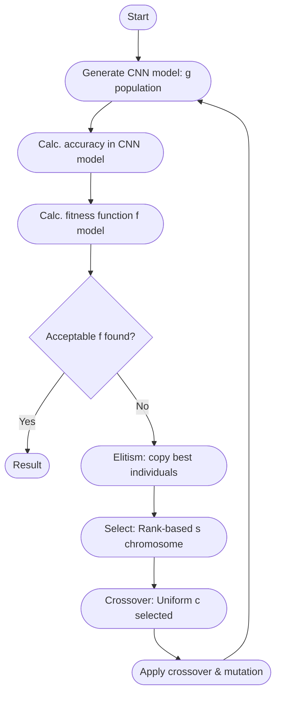

# Genetic Hyperparameter Optimization for CNNs

> **Author**: Adam Makarewicz
>
> This project was developed as the practical implementation for the engineering thesis titled:
>
> **"Parallel Optimization of Neural Network Parameters for a Selected Machine Learning Problem"**

This project implements a sophisticated framework for optimizing the hyperparameters of a Convolutional Neural Network (CNN) using a Genetic Algorithm (GA). It is designed for efficiency and robustness, featuring parallel processing, dynamic resource management, nested cross-validation, and a rich Text-based User Interface (TUI) for real-time monitoring and configuration.

The primary use case demonstrated is tuning a CNN for image classification on the CIFAR-10 dataset.

## Key Features

*   **Genetic Algorithm Engine**: Employs a two-phase GA (optional calibration and main algorithm) to efficiently search the hyperparameter space.
*   **Advanced Parallel Processing**: Supports multiple evaluation modes:
    *   `CPU-Only`: Leverages multiple CPU cores.
    *   `GPU-Only`: Distributes work across all available GPUs.
    *   `Hybrid`: Uses both CPU and GPU workers simultaneously.
*   **Dynamic Resource Management**: Automatically adjusts the number of parallel workers to prevent CPU oversubscription, ensuring optimal performance without manual tuning.
*   **Nested K-Fold Cross-Validation**: Implements a nested resampling strategy to provide a robust and unbiased estimate of the final model's performance on unseen data.
*   **Checkpoint & Resume**: Automatically saves session progress. If the program is interrupted, it can be resumed from the last completed generation, saving significant computation time.
*   **Rich TUI**: A comprehensive Text-based User Interface built with `rich` provides:
    *   Initial configuration of the experiment.
    *   Real-time monitoring of GA progress, including current generation, fold status, and evaluation tasks.
    *   Live log streaming.
    *   A clear summary of the active configuration.

## Technology Stack

*   **Python 3.10+**
*   **PyTorch**: For neural network definition, training, and evaluation.
*   **Rich**: For the interactive and feature-rich TUI.
*   **Loguru**: For flexible and powerful logging.
*   **Scikit-learn**: For splitting data into K folds.

## Project Structure

The project is organized into a modular `src` directory, promoting separation of concerns and maintainability.

```
.
├── checkpoints/              # Stores session checkpoints for resumption
├── configs/                  # Stores configuration files
├── logs/                     # Stores detailed log files for each session
├── model_data/               # Default location for downloaded datasets (CIFAR-10)
└── src/
    ├── config/               # Default configuration and config sanitization
    ├── evaluation/           # Evaluator classes
    ├── genetic/              # Genetic Algorithm implementation (operators, stop conditions)
    ├── logger/               # Loguru logger setup
    ├── model/                # Core data structures
    ├── nn/                   # CNN model, training loop, and data loaders
    ├── resampling/           # Nested cross-validation implementation
    ├── tui/                  # TUI components, layout, and configuration wizard
    ├── utils/                # Helper modules (checkpointing, resource management, etc.)
    ├── ga_runner.py          # Core logic for running GA phases
    └── main.py               # Main application entry point
```

## Installation

1.  **Clone the repository:**
    ```bash
    git clone https://github.com/AdrakPro/parallel_cnn_tuner.git
    cd parallel_cnn_tuner
    ```

2.  **Create and activate a virtual environment (recommended):**
    ```bash
    python -m venv venv
    source venv/bin/activate  # On Windows, use `venv\Scripts\activate`
    ```

3.  **Install the required dependencies:**
    ```bash
    pip install -r requirements.txt
    ```

## How to Run

1.  **Execute the main module:**
    ```bash
    python3 main.py
    ```

2.  **First Run (Configuration):**
    *   On the first run, or if no checkpoint is found, a TUI-based configurator will launch.

3.  **Resuming a Session:**
    *   If a `checkpoints/ga_state.pkl` file is found, the program will ask if you want to resume the previous session.
    *   If you confirm, the experiment will restart from the beginning of the last saved generation, restoring the population and all settings.

## Configuration

### `[project]`
*   `name`: A descriptive name for the experiment, used in logs and UI elements.
*   `seed`: An integer for initializing random number generators. Setting a specific seed ensures that runs are reproducible. `null` uses a random seed.

### `[checkpoint_config]`
*   `interval_per_gen`: The number of generations between saving a checkpoint. `1` means a checkpoint is saved after every generation.

### `[parallel_config]`
*   `execution.evaluation_mode`: Sets the hardware strategy.
    *   `"CPU"`: Uses CPU workers only.
    *   `"GPU"`: Uses GPU workers only.
    *   `"HYBRID"`: Uses both CPU and GPU workers.
*   `execution.enable_parallel`: A master switch to enable or disable parallel processing. If `false`, the entire evaluation runs in a single process.
*   `execution.gpu_workers` / `cpu_workers`: The *desired* number of parallel evaluation processes for each hardware type. The system's resource manager will automatically scale these numbers down if the total requested CPU demand exceeds system capacity.
*   `execution.dataloader_workers`:
    *   `per_gpu` / `per_cpu`: The number of subprocesses each main worker will use for loading data. These add to the total CPU load.

### `[neural_network_config]`
This section defines both the static architecture and the dynamic hyperparameter search space.

*   `input_shape`, `output_classes`, `conv_blocks`: Static architectural parameters defining the CNN's basic shape.
*   `fixed_parameters`: A dictionary of hyperparameters that are *not* optimized by the GA.
*   `hyperparameter_space`: The core of the optimization. Each key represents a "gene" in the chromosome.
    *   `width_scale`: (float) A multiplier for the number of filters in convolutional layers, controlling the model's capacity.
    *   `fc1_units`: (enum) The number of neurons in the first fully-connected layer.
    *   `dropout_rate`: (float) The probability of dropping neurons in the fully-connected layer to prevent overfitting.
    *   `optimizer_schedule`: (enum) A combination of the optimizer (e.g., `SGD`, `ADAMW`) and a learning rate scheduler (`ONECYCLE`, `COSINE`, `EXPONENTIAL`).
    *   `base_lr`: (float, log scale) The initial learning rate. A log scale is used because optimal learning rates can span several orders of magnitude.
    *   `aug_intensity`: (enum) The level of data augmentation applied during training.
    *   `weight_decay`: (float, log scale) The coefficient for L2 regularization, used to penalize large weights and prevent overfitting.
    *   `batch_size`: (enum) The number of samples per batch during training.

### `[nested_validation_config]`
*   `enabled`: If `true`, performs a full Nested K-Fold Cross-Validation. If `false`, performs a single train/validation split for faster, less robust evaluation.
*   `outer_k_folds`: The number of folds for the outer loop of the cross-validation. The model is trained `k` times on different data subsets.

### `[genetic_algorithm_config]`
This section controls the entire evolutionary process.

*   `genetic_operators`:
    *   `selection`: `tournament` selection is used, where `tournament_size` individuals are randomly picked, and the best one becomes a parent.
    *   `crossover`: `uniform` crossover is used, with `crossover_prob` being the chance that two parents will produce offspring by swapping genes.
    *   `mutation`: Defines the probabilities and strength (`sigma`) of mutation for different gene types (discrete, categorical, continuous).
    *   `elitism_percent`: The percentage of the top-performing individuals from one generation that are guaranteed to pass unchanged to the next, preserving the best solutions found so far.

*   `calibration` & `main_algorithm`: The GA is split into two phases.
    *   **Calibration Phase**: A fast, broad search to quickly find promising areas.
        *   `enabled`: Toggles this phase.
        *   `population_size`: Number of individuals in each generation.
        *   `generations`: Maximum number of generations for this phase.
        *   `training_epochs`: Number of epochs to train each individual. Kept low for speed.
        *   `data_subset_percentage`: Trains on a small fraction of the data to accelerate evaluation.
    *   **Main Algorithm Phase**: A slower, deeper search using the best results from the calibration phase.
        *   Uses a smaller `population_size` but more `generations` and `training_epochs`. It always uses the full dataset.

*   `stop_conditions` (for each phase):
    *   `max_generations`: The hard limit on the number of generations.
    *   `early_stop_generations`: Stops if the best fitness score doesn't improve for this many generations.
    *   `early_stop_epochs`: The number of epochs for the early stopping patience within a single model's training loop.
    *   `fitness_goal`: A target fitness score that will stop the algorithm if reached.
    *   `time_limit_minutes`: A time budget for the run (0 means no limit).

## Core Concepts Explained

### Sequential vs. Parallel Computing

The framework can operate in two distinct execution modes, controlled by the `enable_parallel` flag in the configuration.

*   **Sequential Mode (`enable_parallel: false`)**: In this mode, the program operates in a single process. When a generation of individuals needs to be evaluated, the evaluator processes them one by one. The training and testing for the first individual completes before the second one begins. This mode is significantly slower but is invaluable for debugging, as the program flow is linear and stack traces are straightforward.

*   **Parallel Mode (`enable_parallel: true`)**: This is the default and recommended mode for performance. When evaluation begins, a pool of worker processes is created based on the `evaluation_mode` (`CPU`, `GPU`, or `HYBRID`). The `ParallelEvaluator` distributes the individuals of the generation as tasks to these workers via a shared queue. Multiple individuals are trained and evaluated concurrently. This drastically reduces the time-per-generation, making large-scale experiments feasible.

### Genetic Algorithm

The GA treats a set of hyperparameters as a `Chromosome`. A `Population` of these chromosomes is evolved over `Generations`. In each generation:
1.  **Fitness Evaluation**: Each chromosome's fitness is determined by training a CNN with its hyperparameters and measuring the test accuracy. This is the most computationally expensive step and is heavily parallelized.
2.  **Selection**: The fittest individuals are more likely to be selected as "parents" for the next generation.
3.  **Crossover**: Pairs of parents exchange parts of their genetic material (hyperparameters) to create offspring.
4.  **Mutation**: Small, random changes are introduced into the offspring's genes to maintain genetic diversity and explore new parts of the search space.
5. **Elitism:** The best-performing individuals are carried over unchanged to the next generation to ensure top solutions are preserved.


To accelerate the search, a two-phase approach is used. The main algorithm is not started from a random population; instead, it is initialized with the best-performing individuals discovered during the preceding calibration phase, which has limited resources. To ensure this new population is diverse, stratification is used to select individuals from different performance tiers of the calibration results. This ensures the main, computationally expensive search begins from a high-quality, promising area of the hyperparameter space.

### CNN Architecture

The project uses a flexible Convolutional Neural Network (CNN) architecture that is dynamically constructed based on the parameters in the `neural_network_config` section of the configuration file.

*   **Convolutional Base**: The core of the network consists of a series of convolutional blocks. Each block is composed of two `Conv2d` layers followed by a `MaxPool2d` layer for down-sampling.
*   **Dynamic Width**: The number of filters (the "width") in the convolutional layers is not fixed. It starts with `base_filters` and is scaled by the `width_scale` hyperparameter. This allows the GA to control the model's capacity, searching for a balance between representational power and overfitting.
*   **Activation Function**: A configurable activation function is applied after each convolutional layer.
*   **Classifier Head**: After the convolutional blocks, the feature map is flattened into a vector and passed to a classifier head. This head consists of:
    1.  A fully-connected `Linear` layer whose size is determined by the `fc1_units` hyperparameter.
    2.  A `Dropout` layer, with the dropout probability set by the `dropout_rate` hyperparameter, to provide regularization.
    3.  A final `Linear` output layer with `output_classes` neurons, which produces the final classification scores.

### Dynamic Resource Management

To maximize performance, the system calculates the total CPU core demand based on the number of CPU/GPU workers and their respective dataloader subprocesses. If this demand exceeds the available cores on the machine, it proportionally scales down the number of workers to prevent CPU thrashing, logging the adjustments made.

### Nested Resampling

When enabled, this provides a highly reliable estimate of the chosen hyperparameters' performance.
*   **Outer Loop**: The dataset is split into `K` folds. For each fold, one part is held out as the final test set, and the rest is used for the GA.
*   **Inner "Loop" (GA Run)**: The GA runs on the training/validation data to find the best set of hyperparameters.
*   **Final Assessment**: The best model from the GA is evaluated on the held-out test set from the outer loop.
The final performance is the average score across all `K` folds, giving a much more robust metric than a single train/test split.

# Contact me
adam.makarewicz@proton.me
